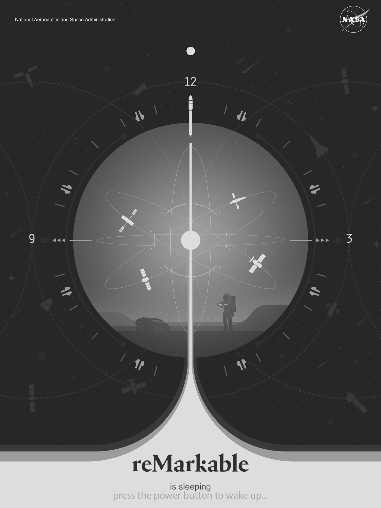
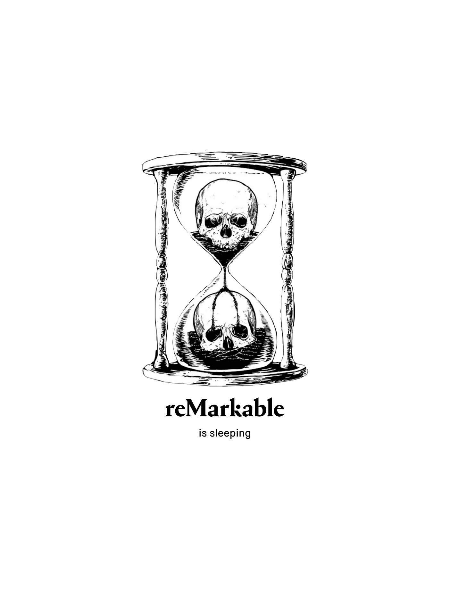
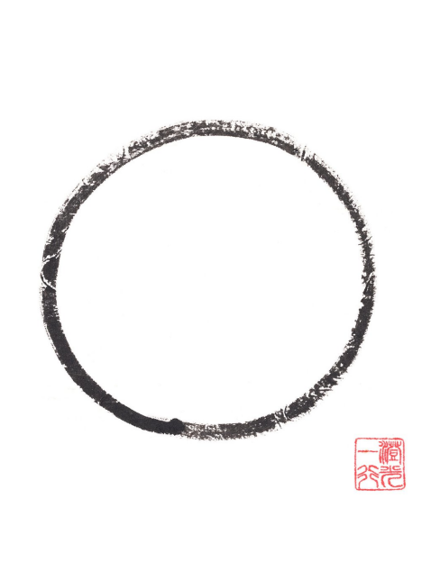

# Sleep Screen Previews

## s1

## s2

## s3

## s4

## s5

## s6

## s7

## s8

## s9

## s10

## s11

## s12

## s13

## s14

## s15

## s16

## s17

## s18

## s19

## s20

## s21

## s22

## s23

## s24

## s25

## s26

## s27

## s28

## s29

## s30

## s31

## s32

## s33

## s34

## s35

## s36

## s37

## s38

## s39

## s40

## s41

## s42

## s43

